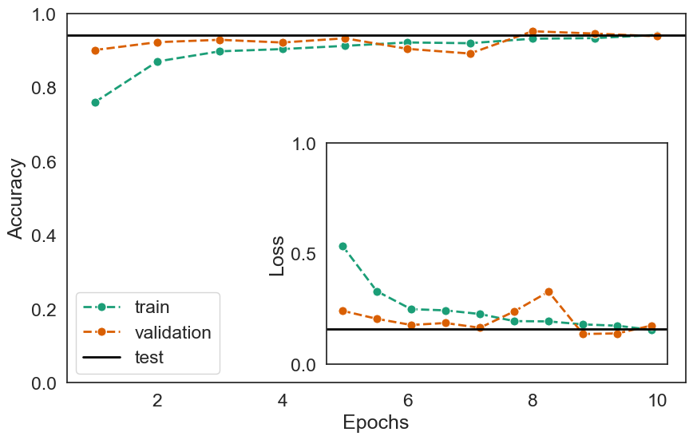
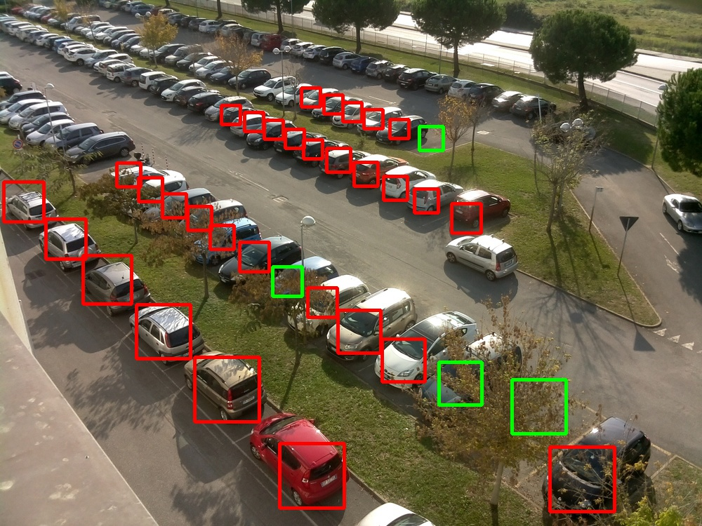
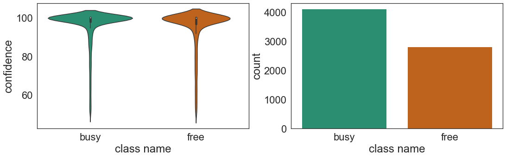

# OpenCV parking lot detection
 
We provide a possible strategy for detecting parking lots in a given camera image, the design is based on [OpenCV](https://opencv.org/) and a CNN classifier implementedn using [TensorFlow](https://www.tensorflow.org/).

The code is, at the state of art, adapted to analyze images coming from [CNRPark+EXT](http://cnrpark.it) dataset, even though we plan to extend the study to [PKLot](https://web.inf.ufpr.br/vri/databases/parking-lot-database/) as well.

### Structure of the code
The src folder contains the code for the classifier, pre- and post-processing of images,data are meant to be saved in the parent directory.
A typical workflow follows.
To download the datasets run:
```
git clone https://github.com/nicolezattarin/OpenCV-parking-lot-detection.git
cd OpenCV-parking-lot-detection
wget http://cnrpark.it/dataset/CNR-EXT_FULL_IMAGE_1000x750.tar
tar -xvf CNR-EXT_FULL_IMAGE_1000x750.tar
wget http://cnrpark.it/dataset/CNR-EXT-Patches-150x150.zip
unzip CNR-EXT-Patches-150x150.zip
wget http://cnrpark.it/dataset/CNRPark-Patches-150x150.zip
unzip CNRPark-Patches-150x150.zip

````

Then, manually check and put the right path in utils.cpp (lines 145, 158), and perform preprocessing:

```
cd src 
cd preprocessing
make
# run a possible configuration for the preprocessing, e.g.:
./main 1 sunny 0 0 0
```
Once the images are ready, you need to eventually train the classifier:
```
cd ../CNNClassifier
python classifier_train.py --epochs 10 --batch_size 32 --save True
```
make sure that the first time you run the script the flag save is True, this allows to prepare data in the correct way for the generator to work, after the first time it is recommendend to set it to False for time complexity reasons.

Then, you can perform the actual detection:
```
python classificationCNR.py 
```
with the parameters that can be retrieved by simply running `python classificationCNR.py --h`.

Finally, you can have a direct access to results with a final post-processing:
```
cd ../postprocessing
make
./main 1 sunny 0 0 0
```

### Results
Let us first providea proof of the performances of the implemented CNN classifier. The following figure shows the history for train, test and validation accuracy/loss of a model trained with 10 epochs and batch size 32.

<p align="center">
  

</p>

An example of final result, i.e. result after post-processing, is shown in the following figure:

<p align="center">
  
</p>

Finally, we also provide the tools to evaluate the performances of our model and test different possible pre-processing configurations.
The following figure shows the distribution of confidence scores for the detected parking lots and the counting of free/busy lots in absence of any pre-processing, which corresponds to an accuracy of 0.85.

<p align="center">
  
</p>

***Requirements***

Main requirements are:

- Compiler (g++) comptible with C++17
- Tensorflow >= 2.5
- OpenCV 4.5

Other minor python packages that we use are: pandas, numpy, os, argparse, waring, matplotlib, seaborn, tensorboard, errno, cv2

